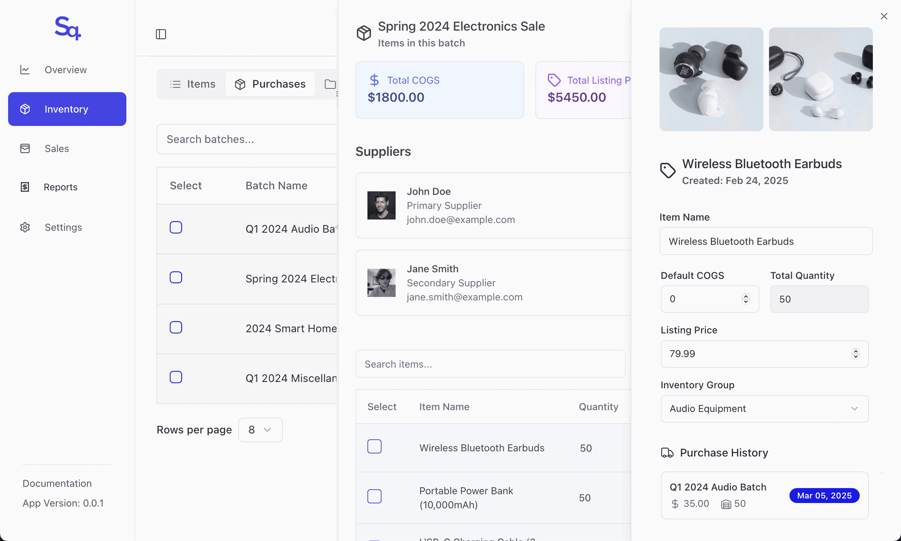

<div align="center">
  
</div>
<p align="center">| <a href="https://trysynq.com">Website</a> | <a href="https://github.com/iamtelmo/synq">Docs</a> |
<br />

Synq is a modern inventory and sales management system designed for individual online sellers. Built for simplicity and efficiency, it helps you track your inventory, manage sales across different platforms, and gain insights into your business performance.

  

## Features

- 📦 **Simple Inventory Tracking** – Monitor stock levels and product details
- 📊 **Sales Overview** – Track sales across different platforms
- 💰 **Basic Profitability** – Calculate costs and revenue
- 🔄 **Data Import/Export** – Easy migration from spreadsheets
- 📈 **Basic Reports** – Generate simple financial insights

## Tech Stack

- **Frontend:**
  - Next.js 15 (App Router)
  - React 19
  - TypeScript 5.5
  - Tailwind CSS 3.4
  - Radix UI components
  - next-safe-action for server actions
  - React Query for data fetching
  - React Hook Form with Zod validation
  - Recharts for data visualization

- **Backend:**
  - Next.js API Routes
  - Supabase for authentication and database
  - Prisma ORM for database operations

- **Development:**
  - Turborepo for monorepo management
  - ESLint and Prettier for code quality
  - TypeScript for type safety

## Project Structure

```
synq/
├── apps/                    # Applications
│   ├── web/                 # Next.js web application (port 3000)
│   └── desktop/             # Desktop application (port 3001)
├── packages/                # Shared packages
│   ├── ui/                  # Shared UI components
│   ├── supabase/            # Supabase client and utilities
│   ├── eslint-config/       # Shared ESLint configuration
│   └── typescript-config/   # Shared TypeScript configuration
├── infra/                   # Supabase for Local Development
│   ├── supabase/        
└── .github/                 # GitHub workflows and templates
```

## Getting Started

### Prerequisites

- Node.js 18.17 or later
- Yarn 1.22.19 or later
- Docker Desktop installed and running
- Supabase CLI installed (see [official documentation](https://supabase.com/docs/guides/cli) for installation methods)

### Installation

1. Clone the repository:
   ```bash
   git clone https://github.com/yourusername/synq.git
   cd synq
   ```

2. Install dependencies:
   ```bash
   yarn install
   ```

3. Start Local Supabase:
   ```bash
   cd infra && supabase start
   ```
   This will start the local Supabase instance and output your API credentials.

4. Set up environment variables:
   ```bash
   cp apps/web/.env.example apps/web/.env.local
   ```
   Edit `apps/web/.env.local` with the values from the Supabase start output:
   - `NEXT_PUBLIC_SUPABASE_URL`: http://localhost:54321
   - `NEXT_PUBLIC_SUPABASE_ANON_KEY`: Your anon key from the Supabase start output

5. Reset the database (if needed):
   ```bash
   cd infra && supabase db reset
   ```
   This will run migrations and seed the database with test data.

6. Start the development server:
   ```bash
   yarn dev
   ```

The application will be available at:
- Web Application: http://localhost:3000
- Supabase Dashboard: http://localhost:54323
- Auth Emails: http://localhost:54324
### Development Scripts

- `yarn dev` - Start development server with Turbopack
- `yarn build` - Build the application
- `yarn start` - Start production server
- `yarn lint` - Run ESLint
- `yarn type-check` - Run TypeScript type checking
- `yarn format` - Format code with Prettier

### Troubleshooting

If you encounter issues:

1. Ensure Docker Desktop is running
2. Check Supabase status:
   ```bash
   cd infra && supabase status
   ```
3. Restart Supabase if needed:
   ```bash
   cd infra && supabase start
   ```
4. Reset the database:
   ```bash
   cd infra && supabase db reset
   ```
5. Verify your environment variables in `.env.local`

## Contributing

Feel free to open issues or submit pull requests if you have suggestions for improvements. This is a learning project, and any feedback is welcome!

## License

This project is licensed under the AGPL-3.0 for non-commercial use.

